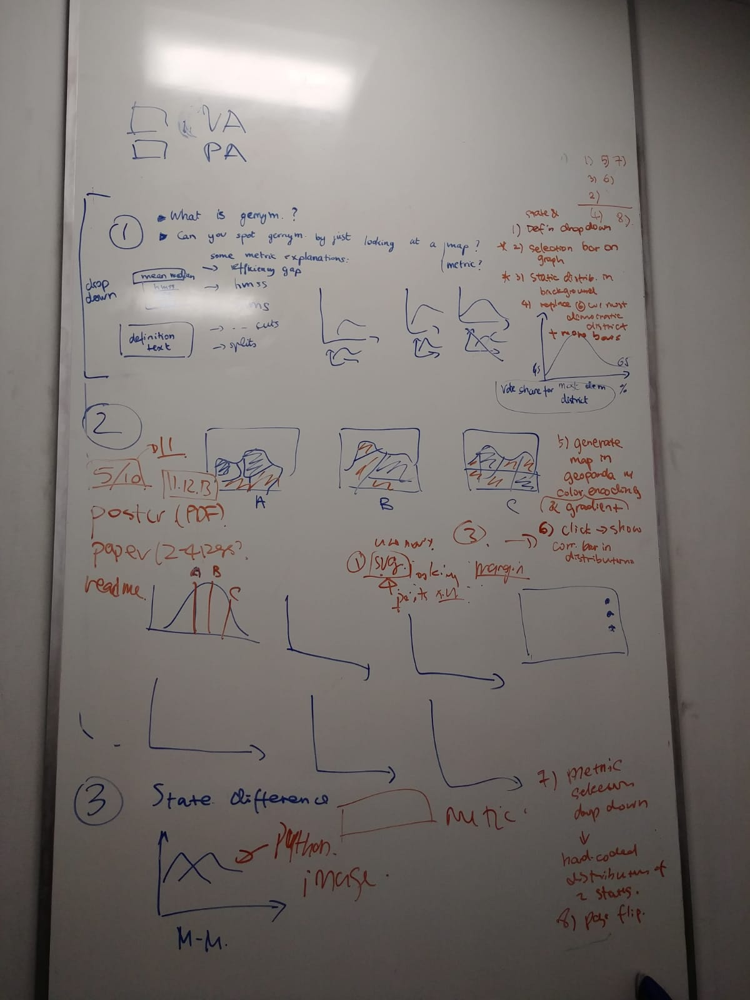
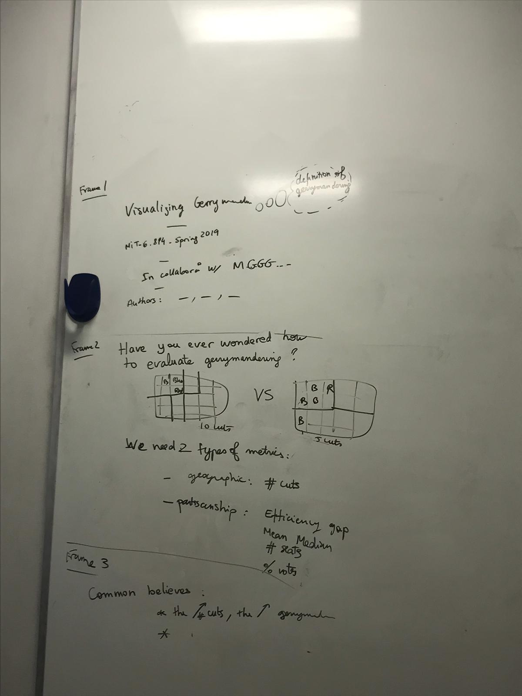

# Visualizing Gerrymandering
Visualization URL: https://github.mit.edu/pages/6894-sp19/Visualizing_Gerrymandering/

## Work Stream Division
* Ideation: all
* Communicating with stakeholders (researchers from MGGG @ MIT CSAIL): all
* Data processing: Kim-Anh-Nhi
* Initial exploratory analysis: Kim-Anh-Nhi & Millie
* Result webpage: Vicky
* Create initial static histogram: Vicky
* Create second static histogram for three map examples: Millie
* Create update histogram and interactive functionalities: Kim-Anh-Nhi
* Interactive map and histogram: Kim-Anh-Nhi
* Dropdowns: Kim-Anh-Nhi & Vicky
* Dropdown images: Vicky
* Generate geopandas map images: Vicky
* Webpage layout: all
* Webpage integration: Kim-Anh-Nhi
* Webpage styling: Kim-Anh-Nhi & Vicky
* Narrative design: Millie
* Supplemental materials and Readme drafting: Millie
* Paper: Millie, Vicky 
* Video: Kim-Anh-Nhi, Vicky
* Poster: all

## Development Process
We first met with researchers from MGGG to understand their project and data and then started the development process with exploratory data analysis. See some interesting results [here](https://github.mit.edu/pages/6894-sp19/Visualizing_Gerrymandering/results.html).

We then went through several iterations of design sketches, incorporating feedback from the researchers and our classmates from the prototype presentation. See some examples below:

                       

Because none of us had much experience with web development or objected-oriented system design, we struggled a lot with merging our code and version control for A3. For the final project, we were able to learn from the previous experience and assigned each individual with different functionalities to realize beforehand and agreed on how they would interact with each other to minimize friction later during code merging. We realize that we still have a long way to go as developers, but this has been a very educational experience nonetheless. 

## Final Presentation
Video at: https://youtu.be/BP2lATQhq-g
